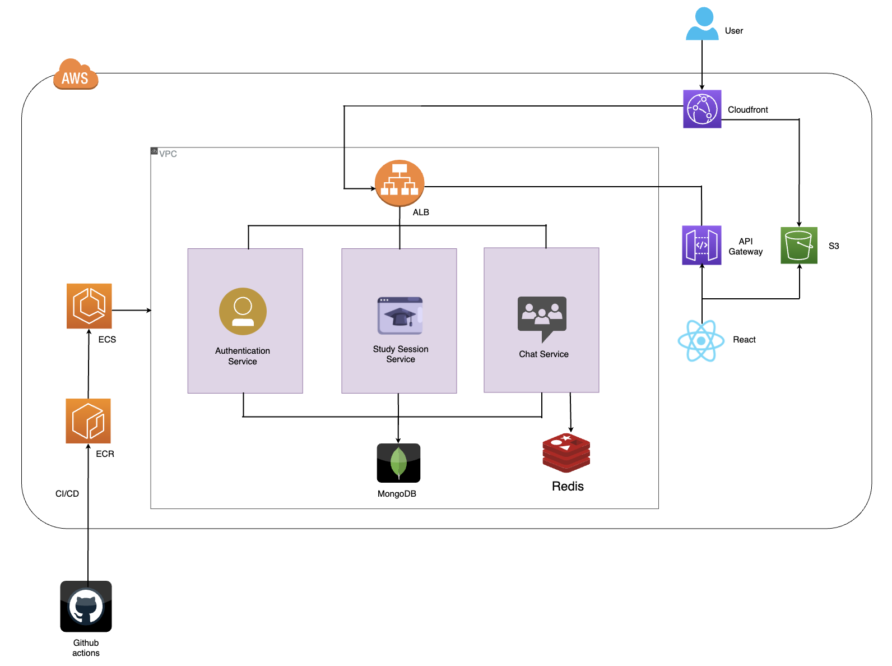

# CS3219 Project: StudyBuddy (Group 20)

## Team members
| Member  | Matriculation number |
| ------------- | ------------- |
| Sylvia Ong Kai Ting  | A0204942J  |
| Kang Min Hui, Mabel  | A0205523R  |
| Lim Hai Shan  |  A0205504U |
| Andrea Tan Ker Yue  | A0205876W  |

## Project description
StudyBuddy is a web application that provides a platform for students to engage in peer
to peer learning and to interact and connect with one another. This 
involves forming study sessions with peers based on 
common modules they are taking and forming categorised chat groups where students
can browse and join the fun!

## Architecture

## How to run
To run locally:

1) Go to the main branch
2) Navigate by running `cd back-end/services/authService`, `cd back-end/services/studySessionService`, 
   `cd back-end/services/chatService`, followed by `npm start` to run each service in its directory. Ensure that authService is run first.
   
3) Navigate to the front-end directory by running `cd front-end`, followed by `npm start` to run the front-end.
You will be navigated to http://localhost:3000.

